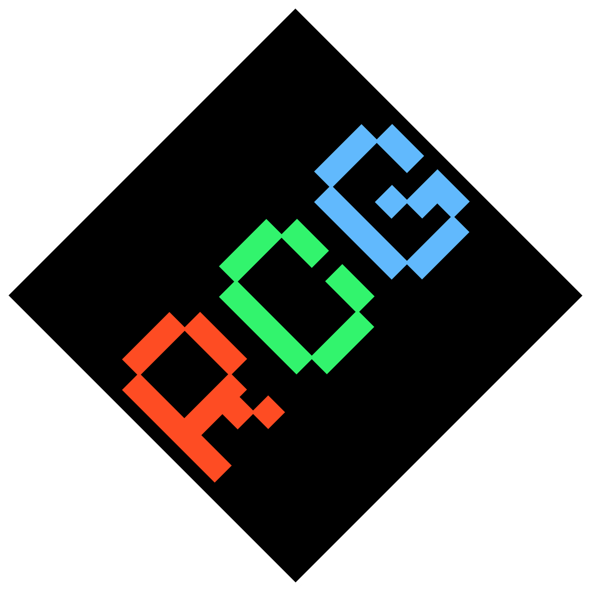

<h1 align="center">RCG Laucher</h1>

<em><h5 align="center">(formerly CT Launcher)</h5></em>

A launcher based on Helios Launcher's Framework

#### Latest Release

**Supported Platforms**

If you download from the [Releases](https://github.com/dscalzi/HeliosLauncher/releases) tab, select the installer for your system.

| Platform | File |
| -------- | ---- |
| Windows x64 | `Helios-Launcher-setup-VERSION.exe` |
| macOS x64 | `Helios-Launcher-setup-VERSION-x64.dmg` |
| macOS arm64 | `Helios-Launcher-setup-VERSION-arm64.dmg` |
| Linux x64 | `Helios-Launcher-setup-VERSION.AppImage` |

You can join my Discord here: For updates on my game dev journeys and my modpacks!

https://discord.com/api/guilds/1232558029547769937/widget.json

---

[nodejs]: https://nodejs.org/en/ 'Node.js'
[vscode]: https://code.visualstudio.com/ 'Visual Studio Code'
[mainprocess]: https://electronjs.org/docs/tutorial/application-architecture#main-and-renderer-processes 'Main Process'
[rendererprocess]: https://electronjs.org/docs/tutorial/application-architecture#main-and-renderer-processes 'Renderer Process'
[chromedebugger]: https://marketplace.visualstudio.com/items?itemName=msjsdiag.debugger-for-chrome 'Debugger for Chrome'
[discord]: https://discord.gg/NTfA9eeYfT 'Discord'
